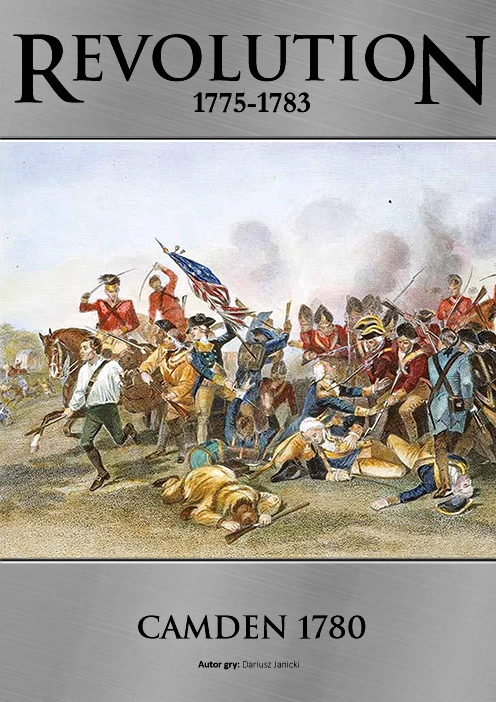
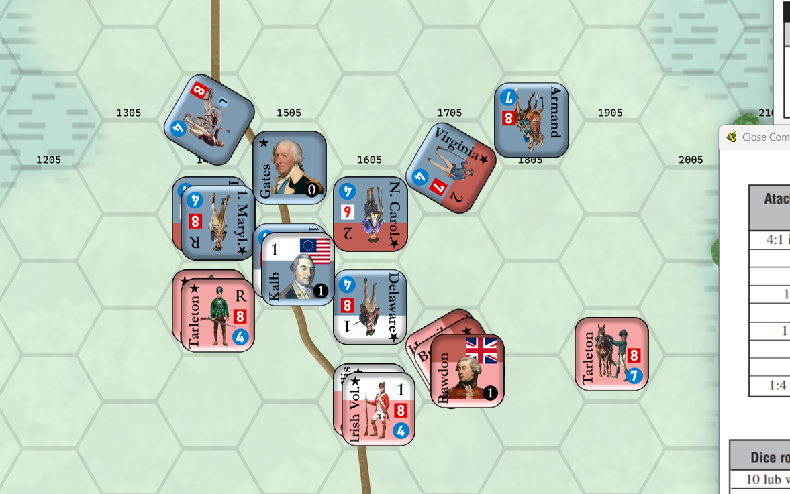

# Scenariusze do Napoleon

Lista przygotowanych przeze mnie scenariuszy do systemu Napoleon wydawnictwa Taktyka i Strategia.

* 👉 System WW3 Taktyka i Strategia https://taktykaistrategia.pl/kategoria-produktu/nasze-gry/?query_type_system=or&filter_system=napoleon
* 👉 Sklep Taktyka i Strategia https://taktykaistrategiasklep.pl/

## Jak uruchamiać

Do gry niezbędna jest aplikacja Vassal. Jest to darmowy silnik do uruchamiania wirtualnych gier planszowych. Można ją pobrać tutaj: https://vassalengine.org/download.html

* Pobierz i uruchom moduł **Napoleon TiS.vmod**. Jest to podstawowa wersja gry, nie zawiera scenariuszy.
* W folderze ze scenariuszami pobierz odpowiedni plik **Rozszerzenie - xxx.vmdx** i zainstaluj go jako dodatek do modułu **Napoleon TiS** w Vassal.


## 📁 Struktura repozytorium

``` yaml
napoleon/
│
├── Napoleon TiS.vmod          # Podstawowy moduł Vassal, nie zawierający żadnych scenariuszy.
├── resources/                 # Wspólne zasoby: ikonki, dźwięki, itp.
└── scenarios/                 # Katalogi scenariuszy:
  └── [nazwa_scenariusza]/
    ├── graphics/              # Mapy, jednostki, okładki, screeny
    ├── scenario/              # Opisy scenariuszy i zmiany zasad
    ├── psd/                   # Źródła graficzne (Photoshop)
    ├── saves/                 # Zapisy do gry (np. rozstawienie początkowe)
    ├── *.vmdx                 # Rozszerzenie do głównego modułu
```

## 🎲 Scenariusze

---

### 1️⃣ Camden 1780



Jedna z bitew Amerykańskiej Rewolucji - wojska Horatio Gatesa próbują powstrzymać brytyjczyków pod Camden.



---

### 2️⃣ Czarnowo 1806
Mapa do gry Czarnowo 1806. Sam scenariusz można znaleźć w Magazynie Taktyka i Strategia nr 49

## Autor

* Dariusz Janicki, 2024 satanjamnic@gmail.com