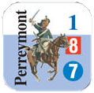
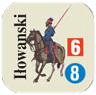
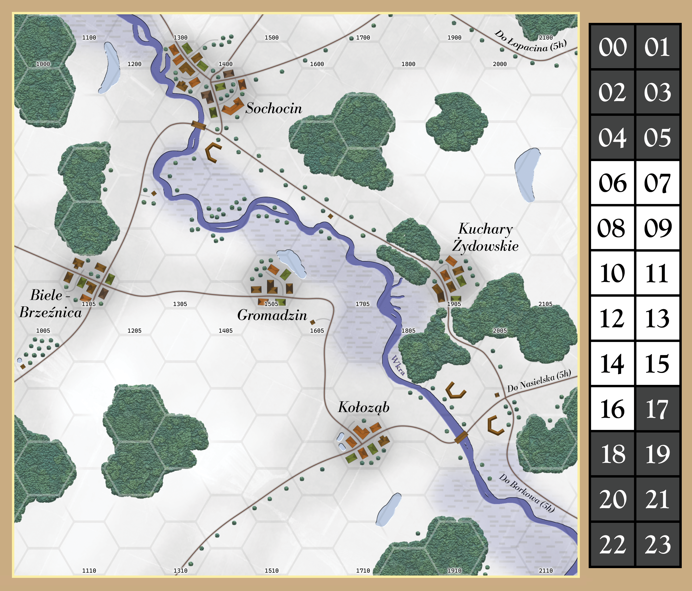

# Borkowo, 24 XII

## Opis

Rankiem 24 grudnia 1806 roku rosyjskie oddziały generała majora Dorochowa oczekiwały francuskiego natarcia pod Borkowem, jako element systemu obronnego rozciągającego się wzdłuż rzek Wkry i Narwi. Jego zadaniem było osłanianie prawego skrzydła Rosjan wycofujących się spod Czarnowa i spowolnienie postępu Francuzów, co miało dać czas na koncentrację sił.

W porównaniu z innymi starciami kampanii działania pod Borkowem — prowadzone przez francuską kawalerię przeciwko rosyjskim siłom rozlokowanym w wąskim wycinku — często pomijane są w popularnych relacjach, mimo że stanowią istotne ogniwo w łańcuchu manewrów poprzedzających bitwy pod Gołyminem i Pułtuskiem.

## Rozstawienie początkowe

### 1 Dywizja Dragonów gen. Kleina i Lekka Brygada gen. Lasalle

Żeton | hex    |        |        | | | |
--- |--------|--------|--------|-------|------| - |
 | `1309` |        |        | | |
| `1309` | **5**  | **4**  | **3** | **2** | **1**
 | `1408` | **5**  | **4**  | **3** | **2** | **1**
 | `1310` | **5**  | **4**  | **3** | **2** | **1**
 | `1310` |        |        | | | **1**
 | |        |        |        | |
 | `1710` | |  **4** | **3** | **2** | **1**

### Detaszment gen. mjr Dorochowa

Żeton | hex    |       |       |       |       |       |       |
--- |--------|-------|-------|-------|-------|-------|-------|
 | `1703` | **6** | **5** | **4** | **3** | **2** | **1** 
  | `1704` | | |       | **3** | **2** | **1**   
 | `1704` | | |       |       |       | **1** 
 | `2107` | ||       | **3** | **2** | **1**

## Punktacja

### Rosjanie:
* +1 PZ za każdą rozpoczętą godzinę starcia
* +1 PZ za każdy PS strat zadany francuzom

### Francuzi:
* Na początku mają 5 PZ, za każdą kolejną rozpoczętą godzinę starcia -1 PZ
* +1 PZ za każdy żeton który opuścił mapę drogą do Nasielska

## Zasady specjalne

* Bitwa zaczyna się o 11:00, inicjatywę mają Francuzi.
* Traktujemy żetony 1 Dywizji Dragonów jakby miały gwiazdkę - prowadzą ostrzał zgodnie z ostrzałem kawalerii.
* Jednostka huzarów Dorochow spełnia rolę dowódcy dla wojsk rosyjskich. Jego Modyfikator Dowodzenia to 0.

## Teren specjalny

  Typ Terenu | Wpływ na ruch | WO / WK | WW
  --- |---------------|----|----
  droga | 1/2           | -  | - 
  bagno | +2            | -  | -2  
  rzeka (Wkra)  | +2            | -1   | -1  
  reduta | -             | -1 | -1 

## Mapa:

