# Sochocin-Kołoząb, 24 XII

## Opis

Tego dnia Francuzi, maszerujący ku przeprawom na Wkrze, natrafili na silnie broniony most w Kołoząbie. Rosjanie pod dowództwem Barclaya de Tolly’ego przygotowali tam redutę z artylerią i piechotą, mającą powstrzymać natarcie. Mimo silnego ostrzału i strat, oddziały Augereau zdołały przypuścić skuteczny szturm i zdobyć most, co otworzyło Francuzom drogę na drugi brzeg rzeki.

Równocześnie Rosjanie bronili przeprawy w Sochocinie, gdzie zakole Wkry i trudny teren czyniły pozycję wyjątkowo korzystną dla obrony. Próby forsowania mostu przez Francuzów kończyły się niepowodzeniem, a Rosjanie skutecznie odpierali kolejne natarcia. Dopiero po sukcesie Francuzów w Kołoząbie i zagrożeniu obejściem od południa, Rosjanie zmuszeni byli opuścić Sochocin, wycofując się w stronę głównych sił.

## Rozstawienie początkowe

### VII Korpus marszałka Augereau

Grupa atakująca Kołoząb (1 Dywizja Piechoty VII Korpusu z Brygadą Kawalerii Lekkiej Milhauda):

 Żeton     | hex    |        |        |        |        |       |       |       |       |       |       |       |       |       |
-----------|--------|--------|--------|--------|--------|-------|-------|-------|-------|-------|-------|-------|-------|-------|
 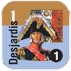 | `1409` |        |        |        |        | 
 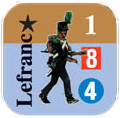   | `1409` | **13** | **12** | **11** | **10** | **9** | **8** | **7** | **6** | **5** | **4** | **3**| **2**| **1**
 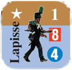    | `1310` |  |    | | |       |        | **7**  | **6** | **5** | **4** | **3**| **2**| **1**
   | `1310` |    |        |        |        |       |       |       |       |       | | **3** | **2** | **1** 
 |           |        |        |        |        |
  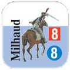   | `1509` |   | |        |        |       |        |        | |       | **4** | **3** | **2** | **1** 

Grupa atakująca Sochocin (2 Dywizja Piechoty VII Korpusu):

 Żeton     | hex    |        |        |        |        |       |       |       |       |       |       |       |       |       |
-----------|--------|--------|--------|--------|--------|-------|-------|-------|-------|-------|-------|-------|-------|-------|
  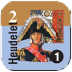 | `1106` |        |        |        |        |
  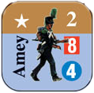   | `1106` | **13** | **12** | **11** | **10** | **9** | **8** | **7** | **6** | **5** | **4** | **3**| **2**| **1**
  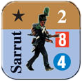   | `1006` |  |  |        |        |       |       | **7** | **6** | **5** | **4** | **3**| **2**| **1**
   | `1006` |        |      | | |       |       |       |       |       | | **3** | **2** | **1** 
|           |        |        |        |        |
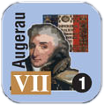   | `1104` | 
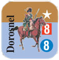   | `1104` |        |        |        |   | | |       | **6** | **5** | **4** | **3** | **2** | **1** 
 

### Detaszment gen. mjr Barclay'a de Tolly

Obrońcy Sochocina col. Davydovskii

Żeton | hex    |       |       |       |       |       |       |
--- |--------|-------|-------|-------|-------|-------|-------|
  | `1402` |  |  | **4** | **3** | **2** | **1** 
   | `1401` | | |       | **3** | **2** | **1**   
  | `1402` | | |       |       |       | **1**

Obrońcy Kołoząbu Barclay de Tolly

Żeton | hex    |       |       |       |       |       |       |
--- |--------|-------|-------|-------|-------|-------|-------|
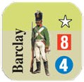  | `1907` |  |  | **4** | **3** | **2** | **1** 
   | `2007` | | |       | **3** | **2** | **1**   
  | `2007` | | |       |       |       | **1**

Odwód

Żeton | hex    |       |       |       |       |       |       |
--- |--------|-------|-------|-------|-------|-------|-------|
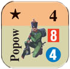  | `1704` | **6** | **5** | **4** | **3** | **2** | **1** 

## Punktacja

### Rosjanie:
* +1 PZ za każdą rozpoczętą godzinę starcia
* +1 PZ za każdy PS strat zadany francuzom

### Francuzi:
* Na początku mają 5 PZ, za każdą kolejną rozpoczętą godzinę starcia -1 PZ
* +1 PZ za każdy żeton który opuścił mapę drogą do Nasielska

## Zasady specjalne

* Bitwa zaczyna się o 11:00, inicjatywę mają Francuzi.
* Jednostki piechoty Barclay i Markov 2 spełniają rolę dowódcy dla wojsk rosyjskich. Ich Modyfikator Dowodzenia to 0.

## Teren specjalny

  Typ Terenu | Wpływ na ruch | WO / WK | WW
  --- |---------------|----|----
  droga | 1/2           | -  | - 
  bagno | +2            | -  | -2  
  rzeka (Wkra)  | +2            | -1   | -1  
  reduta | -             | -1 | -1 

## Mapa:

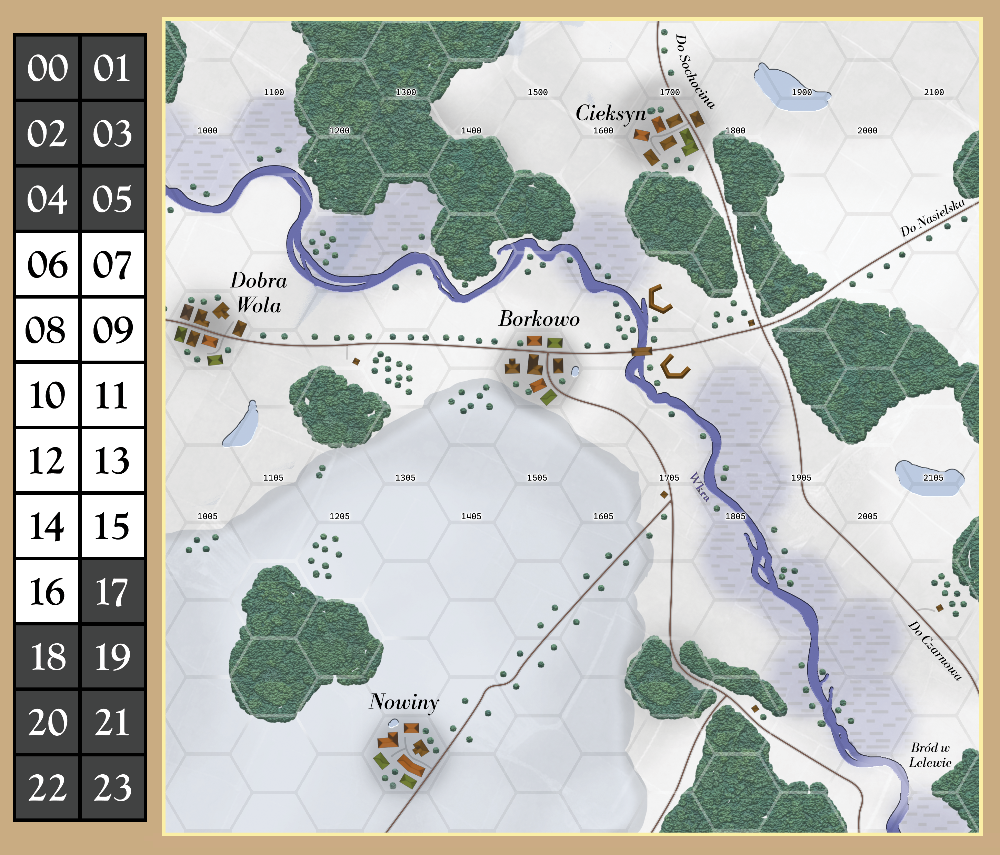